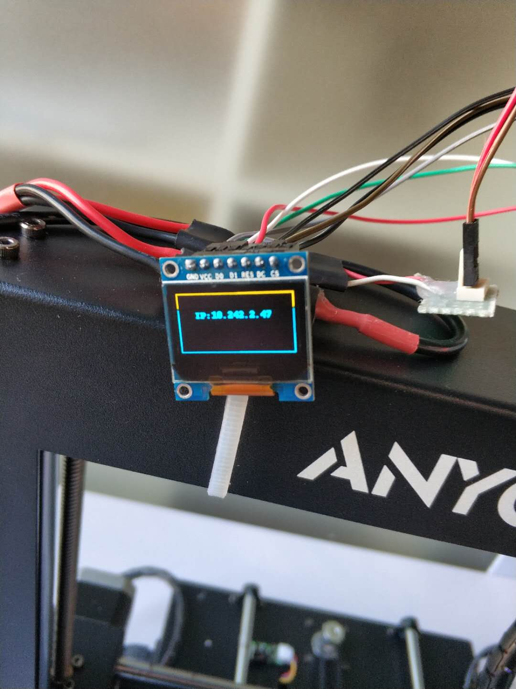

树莓派无屏连接WIFI并在OLED屏显示IP地址



# 安装系统并配置
推荐安装Raspbian
1. 修改/boot/config.txt
```
# 添加打开串口的选项
# Enable UART
enable_uart=1
```
2. 配置wifi连接
参考如下代码
```
country=CN
ctrl_interface=DIR=/var/run/wpa_supplicant GROUP=netdev
update_config=1

# 如果你的 WiFi 没有密码
network={
ssid="你的无线网络名称（ssid）"
key_mgmt=NONE
}

# 如果你的 WiFi 使用WEP加密
network={
ssid="你的无线网络名称（ssid）"
key_mgmt=NONE
wep_key0="你的wifi密码"
}


# 如果你的 WiFi 使用WPA/WPA2加密
network={
ssid="你的无线网络名称（ssid）"
key_mgmt=WPA-PSK
psk="你的wifi密码"
}

# 如果是企业WPA加密wifi，使用下面的试试
network={
  ssid="你的无线网络名称（ssid）"
  key_mgmt=WPA-EAP
  pairwise=CCMP TKIP
  group=CCMP TKIP
  eap=PEAP
  identity="用户名"
  password="密码"
  phase1="peaplabel=auto pepver=auto"
  phase2="MSCHAPV2"
}
```
3. 连接串口终端，可以使用xshell等工具


# 开启IIC
树莓派使用IIC很简单，只需要在raspi-config里面打开IIC即可
```
sudo raspi-config

# 依次选取 5 Interfacing Options >>> P5 I2C >>> <YES> >>> <OK> >>> <Finish>

ls /dev/i2c*
# 会发现/dev下已经有驱动节点
```

# OLED屏幕
1. 连接OLED屏幕到树莓派的I2C1接口
2. 安装luma.oled，一个驱动树莓派oled的python开源包,参考网站
> [https://luma-oled.readthedocs.io/en/latest/install.html](https://luma-oled.readthedocs.io/en/latest/install.html)
3. 可以尝试运行官方给的Demo代码，还有很多有意思的实例程序。
> [https://github.com/rm-hull/luma.examples](https://github.com/rm-hull/luma.examples)
4. 在/etc/rc.local中 exit 0 前面添加一句脚本
```
python /home/pi/oled.py &
```
这样就可以开机自动执行一次显示ip的脚本了，位置可以自行修改
